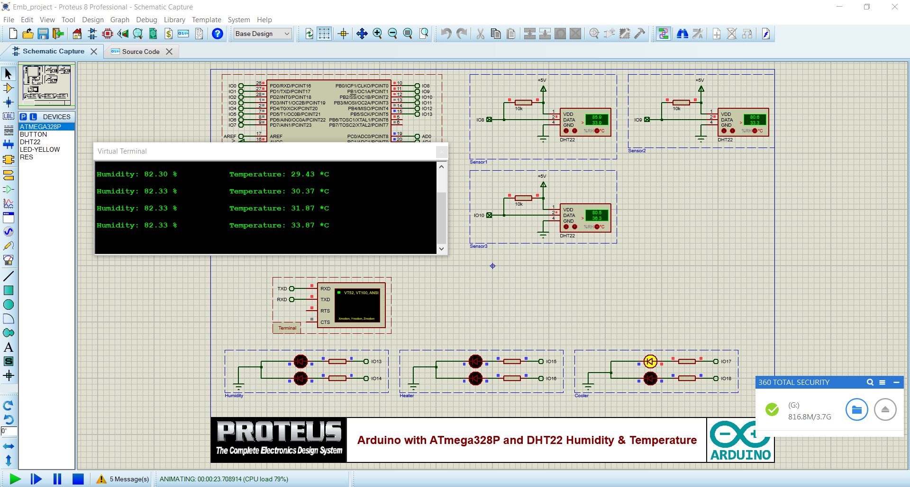
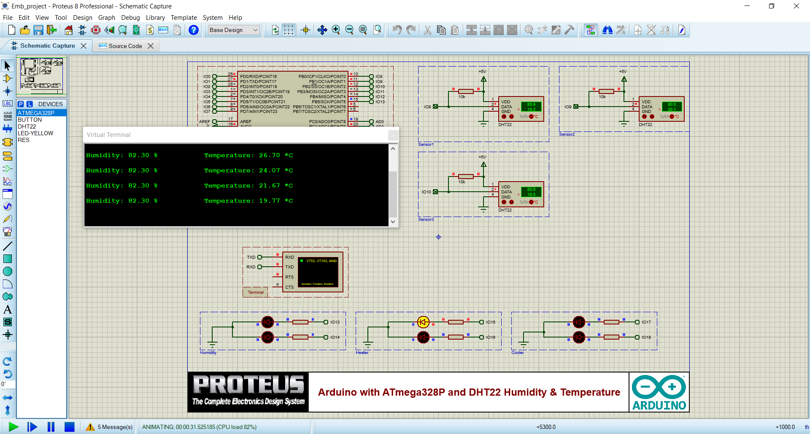
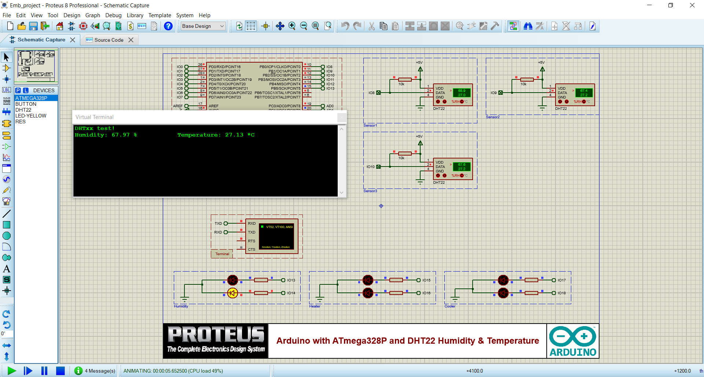
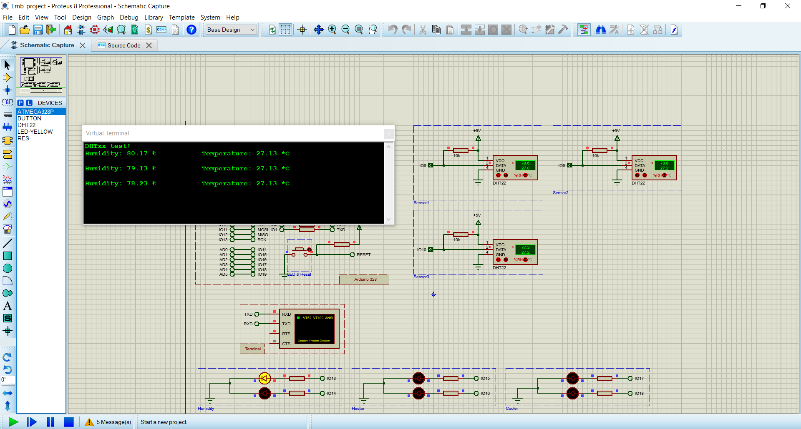

## Project Overview

The **Air Controller System** is an embedded project designed to monitor and control environmental parameters such as temperature and humidity using multiple sensors and actuators. It uses the DHT22 sensor for precise measurements and controls heating, cooling, and humidity mechanisms based on the environment's needs.

This project integrates software and hardware components, showcasing embedded systems programming, real-time control, and simulation using Proteus.

---

## Features

- **Multi-Sensor Monitoring**: Reads temperature and humidity from three DHT22 sensors.
- **Automated Control**:
  - Activates heaters for low temperatures.
  - Engages coolers for high temperatures.
  - Maintains humidity within predefined thresholds.
- **Real-Time Averaging**: Calculates average temperature and humidity from multiple sensors to provide robust control.
- **Simulation**: Includes a Proteus schematic for hardware simulation.

---

## Key Technologies

- **Hardware**:
  - ATmega328P Microcontroller.
  - DHT22 sensors for temperature and humidity.
  - Actuators (heaters, coolers, and humidity controllers).
- **Software**:
  - Embedded C++ code (Arduino IDE).
  - Proteus for hardware simulation and testing.
- **Programming Libraries**:
  - DHT library for interfacing with sensors.

---

## Project Structure

```plaintext
Air-Controller-System/
│
├── src/
│   ├── main.ino            # Arduino-based embedded system code
│
├── simulation/
│   ├── shematic.pdsprj      # Proteus project file
│
├── media/
│   ├── schematic.PNG       # System schematic
│   ├── atFirst.PNG         # Initial simulation state
│   ├── Cooler_High.PNG     # Cooler activated
│   ├── Cooler_Low.PNG      # Cooler deactivated
│   ├── Heater_High.PNG     # Heater activated
│   ├── Heater_Low.PNG      # Heater deactivated
│   ├── Humidity_High.PNG   # Humidity control activated
│   ├── Humidity_Low.PNG    # Humidity control deactivated
│
├── README.md               # Project overview and documentation
└── LICENSE                 # License information
```

## Schematic
The schematic below illustrates the system's design, as simulated in Proteus:


## Installation and Usage

### Prerequisites
- **Software**:
  - Arduino IDE (for uploading code to the microcontroller).
  - Proteus Design Suite (for simulation).
- **Hardware (if applicable)**:
  - ATmega328P
  - DHT22 sensors
  - Resistors
  - LEDs

### Steps

1. Clone the repository:
   ```bash
   git clone https://github.com/your-username/Air-Controller-system.git
   cd Air-Controller-system ```
2. Open the main.ino file in Arduino IDE, and upload it to the ATmega328P microcontroller.
3. Open proteus.pdsprj in Proteus to simulate the system's hardware behavior.
4. Connect hardware components as per the Proteus schematic if deploying physically.


## Working

### Temperature Control
- If the average temperature (`avgT`) falls below **15°C**, the system activates the high-power heater.
- If `avgT` exceeds **38°C**, the system activates the cooler.

### Humidity Control
- If the average humidity (`avgH`) drops below **70%**, the system increases humidity.
- If `avgH` exceeds **85%**, the system disables the humidity controller.

### Monitoring
- The system continuously prints average temperature and humidity readings to the serial terminal.

## Simulation Screenshots

### Initial State
The simulation begins with the system in its initial state, as shown below:


---

### Temperature Control
The following screenshots showcase how the system responds to varying temperature levels:

- **Cooler Activated at High Temperature**  
  The system engages the cooler when the average temperature exceeds the upper threshold:  
  

- **Cooler Deactivated**  
  The cooler is turned off when the temperature falls below the threshold:  
  

- **Heater Activated at Low Temperature**  
  The heater is activated when the temperature drops below the lower threshold:  
  

- **Heater Deactivated**  
  The heater is turned off once the temperature reaches a stable range:  
  

---

### Humidity Control
The system efficiently manages humidity to maintain it within the desired range. The screenshots below highlight this functionality:

- **Humidity Increase Activated**  
  The humidity controller is activated to increase humidity when it drops below the lower threshold:  
  

- **Humidity Control Deactivated**  
  The humidity controller is deactivated once the desired humidity level is restored:  
  


## Future Enhancements

- Add a GUI for remote monitoring and control.
- Incorporate wireless communication (e.g., Bluetooth or Wi-Fi).
- Expand to handle more environmental parameters, such as air quality.

## License

This project is licensed under the **MIT License**. See the `LICENSE` file for details.

## Contact

For questions or feedback, please open an issue in the repository or contact **ysmngolshan@gmail.com**.

